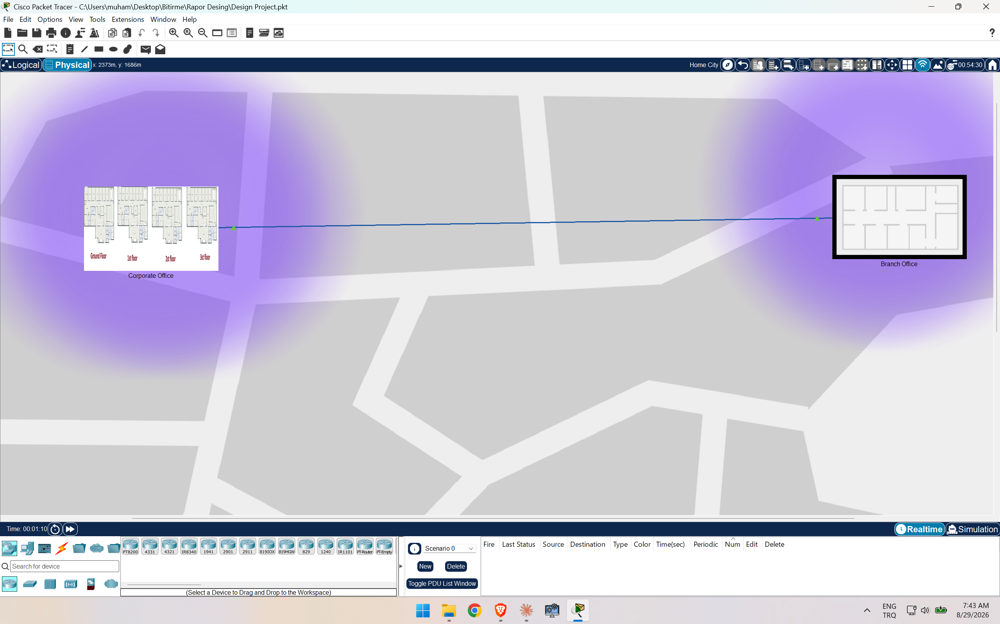

# Mid-Size Enterprise Network Design (HQ + Branch)

Cisco Packet Tracer network design project — B.Sc. Computer Engineering, Erciyes University.

## Overview

End-to-end design and configuration of a two-site enterprise network: a **Headquarters (HQ)** and a **Branch Office (BR)**, connected over a WAN link. The network is built as a hierarchical **Core / Access** topology with department-based VLAN segmentation, dynamic routing, centralized services, and layered security — the kind of design a real mid-size company network would use.



## Topology

- **HQ:** `HQ-EDGE` (internet + WAN edge) → `HQ-CORE` (Layer-3 core, VLAN gateways, OSPF) → `HQ-IDF-1/2/3` (Layer-2 access switches per floor)
- **Branch:** `Router (BR-ROUTER)` (WAN edge) → `BR-CORE` (Layer-3 core) → `BR-IDF-1/2-SWITCH` (access switches)
- HQ and Branch are connected over a serial WAN link, with all inter-site routing handled by OSPF.

A hierarchical Core/Access design was chosen over a flat network for scalability, easier fault isolation, and cleaner security boundaries between departments.

## VLAN & IP addressing

**HQ:**

| VLAN | Purpose | Gateway (SVI) |
|---|---|---|
| 10 | IT / WLC | 10.10.10.1/24 |
| 20 | HR | 10.10.20.1/24 |
| 30 | Finance | 10.10.30.1/24 |
| 40 | R&D | 10.10.40.1/24 |
| 50 | Sales | 10.10.50.1/24 |
| 60 | Printers | 10.10.60.1/24 |
| 70 | Voice (VoIP) | 10.10.70.1/24 |
| 80 | Server Farm | 10.10.80.1/24 |
| 90 | Guest | 10.10.90.1/24 |
| 99 | Native / Management | 10.10.99.1/24 |

**Branch:**

| VLAN | Purpose | Gateway (SVI) |
|---|---|---|
| 110 | IT | 10.10.110.1/24 |
| 115 | Admin | 10.10.115.1/24 |
| 130 | Operations | 10.10.130.1/24 |
| 150 | Sales | 10.10.150.1/24 |
| 160 | Printers | 10.10.160.1/24 |
| 170 | Voice (VoIP) | 10.10.170.1/24 |
| 190 | Guest | 10.10.190.1/24 |
| 199 | Native / Management | 10.10.199.1/24 |

Addressing follows a consistent `10.10.X0.0/24` (HQ) / `10.10.1X0.0/24` (Branch) scheme, so the site is identifiable from the subnet alone.

## Routing & services

- **OSPF (single-area, area 0):** all Layer-3 devices (`HQ-CORE`, `HQ-EDGE`, `BR-CORE`, `BR-ROUTER`) run OSPF so subnets and the best path between sites are learned automatically, without manual static routes. `default-information originate` on `HQ-CORE` propagates the internet default route to the whole network, including the Branch.
- **Centralized DHCP with relay:** a single `DNS-DHCP-SERVER` (10.10.80.53) serves every VLAN at both sites. Each VLAN's SVI uses `ip helper-address` to relay DHCP broadcasts to this central server, instead of configuring per-VLAN DHCP pools on every router.
- **NAT / PAT:** all private `10.10.x.x` traffic is translated to a single public IP on the HQ internet edge via PAT (`ip nat ... overload`), so hundreds of internal hosts can share one public address.
- **Wireless (WLC):** a Wireless LAN Controller centrally manages all lightweight access points (LAPs) across floors, instead of configuring every AP by hand — each department gets its own SSID/VLAN (e.g. `IT-WiFi`, `Finance-WiFi`, `Guest-WiFi`).

## Security

Security is layered at multiple points rather than relying on a single firewall:

- **Port Security** on every access-layer switch port (`switchport port-security`, sticky MAC learning, restrict on violation) — limits each port to the expected number of devices (e.g. an IP phone + PC) and blocks rogue devices.
- **Management-plane ACL:** only the IT VLANs can reach device management (Telnet/SSH) via `access-class` on the VTY lines.
- **Guest network isolation:** an ACL on the guest VLAN allows only DNS/DHCP and internet access, and explicitly denies any path back into the internal `10.10.0.0/16` network.
- **Inter-department filtering:** per-VLAN ACLs restrict each department to only the services it needs (e.g. the central DHCP/DNS server), limiting lateral movement if one host is compromised.
- **Edge protection:** an inbound ACL on the internet-facing interface only allows established connections and ICMP echo-replies, acting as a basic stateful firewall.

## Repository contents

```
enterprise-network-design.pkt   # Full Cisco Packet Tracer topology + device configs
assets/
  site-topology.png             # HQ (multi-floor) + Branch physical site view
  rack-wiring.png                # Branch rack: router/core switch cabling
```

Open the `.pkt` file with [Cisco Packet Tracer](https://www.netacad.com/courses/packet-tracer) (free with a Cisco Networking Academy account) to inspect every device configuration, VLAN, ACL and routing table directly.
